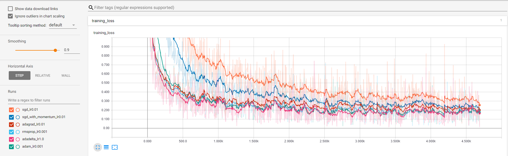

# OptimizerAlgorithm

## Usage
```
python cnn_mnist --optimizer sgd --lr 0.01
```
Other optimizers are supported, including `sgd_with_momentum`, `sgd_with_momentum_and_nesterov`, `adagrad`, `rmsprop`, `adadelta`, `adam`.

## Result
Training loss is compared as follows.

